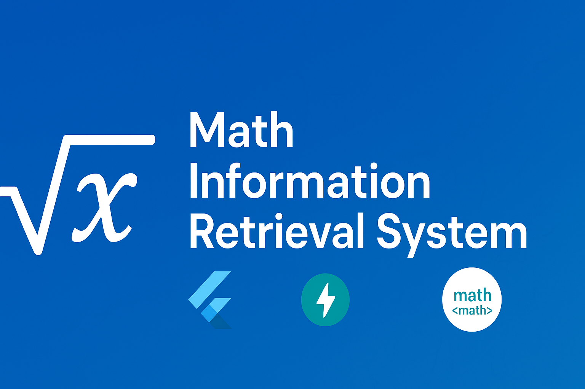

# 

# Math Information Retrieval System

This repository contains **both** the Flutter frontend and the FastAPI backend for a **Clustering-Based Mathematical Information Retrieval (MathIR)** system.

It supports **LaTeX/MathML search**, **cross-platform rendering**, and **fast retrieval** of mathematical documents.

---

## 📌 Features


### Frontend (Flutter)

* 🔍 Search LaTeX or math expressions
* 📄 Render HTML with MathML on Android and Web
* 💡 WebView for Android, iframe + MathJax for Web
* ⏱ Show response time and result count
* ✅ Clean UI with animation, loading indicators, and error handling

### Backend (FastAPI)

* ⚡ Cluster-based approximate nearest neighbor (ANN) search
* 🔢 MiniBatchKMeans with Hamming distance for binary bit-vectors
* 📂 Preprocessing of HTML to extract MathML & LaTeX
* 🚀 Scalable and optimized for large datasets

---

## 📁 Directory Structure

<pre lang="md">
📦 math-ir-system
┣ 📂 frontend
┃ ┣ 📜 main.dart                  # Main search UI and routing logic
┃ ┣ 📜 mobile_html_viewer.dart    # WebView-based HTML renderer for Android
┃ ┣ 📜 web_html_viewer.dart       # iframe-based HTML renderer for Web
┃ ┗ 📜 pubspec.yaml               # Flutter dependencies
┃
┣ 📂 backend
┃ ┣ 📂 MIR_model
┃ ┃ ┣ 📜 cluster_index.py          # Handles cluster index loading and searching
┃ ┃ ┣ 📜 clustering_phase.py       # Performs clustering on bit-vector data
┃ ┃ ┣ 📜 driver_clustering.py      # Triggers clustering and index creation
┃ ┃ ┣ 📜 driver_preprocessing.py   # Preprocesses HTML documents
┃ ┃ ┣ 📜 hamming_mini_batch_kmeans.py  # MiniBatchKMeans adapted for Hamming distance
┃ ┃ ┣ 📜 preprocessing.py          # Extracts MathML & LaTeX, generates bit-vectors
┃ ┃ ┣ 📜 query_processing.py       # Identifies query type and processes
┃ ┃ ┣ 📜 query_to_bitvector.py     # Converts LaTeX → MathML → bit-vector
┃ ┃ ┣ 📜 search_query.py           # Main search execution logic
┃ ┣ 📜 main.py                     # FastAPI entry point
┃ ┣ 📜 requirements.txt            # contains all required library and modules to be install
┃ ┗ 📂 math_index_storage          # Stores models & clustering indices
┗ 📜 README.md

</pre>

---

## Query Set
# If you want to directly copy the latex from the json file then please replace the '//' with '/' and '////' with '//' for perform searching on the UI. but queries given are already UI compatible no need make changes.
# Mathematical Queries that are provided by NTCIR-12: **[http://ntcir-math.nii.ac.jp/](http://ntcir-math.nii.ac.jp/)**

1. **Raw LaTeX** — shows the exact LaTeX code.
2. **Rendered** — shows how it will appear on GitHub.

---

### 1
**Raw LaTeX:**  
-0.026838601\ldots


**Rendered:**  
```math
-0.026838601\ldots
```

---

### 2
**Raw LaTeX:**  
\mathfrak{P}


**Rendered:**  
```math
\mathfrak{P}
```

---

### 3
**Raw LaTeX:**  
N = \left\lfloor 0.5 - \log_{2} \left(\frac{\text{Frequency of this item}}{\text{Frequency of most common item}}\right) \right\rfloor


**Rendered:**  
```math
N = \left\lfloor 0.5 - \log_{2} \left(\frac{\text{Frequency of this item}}{\text{Frequency of most common item}}\right) \right\rfloor
```
---

### 4
**Raw LaTeX:**  
\nabla \times \mathbf{B} = \mu_{0} \mathbf{J} +\underbrace{\mu_{0}\epsilon_{0} \frac{\partial}{\partial t}\mathbf{E}}_{\text{Maxwell's term}}

**Rendered:**  
```math
\nabla \times \mathbf{B} = \mu_{0} \mathbf{J} +\underbrace{\mu_{0}\epsilon_{0} \frac{\partial}{\partial t}\mathbf{E}}_{\text{Maxwell's term}}
```
---

### 5
**Raw LaTeX:**  
1 + \cfrac{1}{2 + \cfrac{1}{5 + \cfrac{1}{5 + \cfrac{1}{4 + \ddots}}}}


**Rendered:**  
```math
1 + \cfrac{1}{2 + \cfrac{1}{5 + \cfrac{1}{5 + \cfrac{1}{4 + \ddots}}}}
```
---

### 6
**Raw LaTeX:**  
^{238}{92}\mathrm{U} + ^{64}{28}\mathrm{Ni} ;\rightarrow;^{302}_{120}\mathrm{Ubn}^{*} ;\rightarrow; \textit{fission only}


**Rendered:**  
```math
^{238}_{92}\mathrm{U} + ^{64}_{28}\mathrm{Ni} \;\rightarrow\;^{302}_{120}\mathrm{Ubn}^{*} \;\rightarrow\; \textit{fission only}
```
---

### 7
**Raw LaTeX:**  
0 \rightarrow G^\wedge \xrightarrow{\pi^\wedge} X^\wedge \xrightarrow{i^\wedge} H^\wedge \rightarrow 0


**Rendered:**  
```math
0 \rightarrow G^\wedge \xrightarrow{\pi^\wedge} X^\wedge \xrightarrow{i^\wedge} H^\wedge \rightarrow 0
```

---

### 8
**Raw LaTeX:**  
w = \begin{cases} w^* & \text{if } w^* > \frac{1}{2}, \ \frac{1}{2} & \text{if } w^* \le \frac{1}{2}. \end{cases}


**Rendered:** 
```math
w = \begin{cases} w^* & \text{if } w^* > \frac{1}{2}, \\ \frac{1}{2} & \text{if } w^* \le \frac{1}{2}. \end{cases}
```
---

### 9
**Raw LaTeX:**  
\begin{bmatrix} V_1 \ I_2 \end{bmatrix} = \begin{bmatrix} h_{11} & h_{12} \ h_{21} & h_{22} \end{bmatrix} \begin{bmatrix} I_1 \ V_2 \end{bmatrix}


**Rendered:**  
```math
\begin{bmatrix} V_1 \\ I_2 \end{bmatrix} = \begin{bmatrix} h_{11} & h_{12} \\ h_{21} & h_{22} \end{bmatrix} \begin{bmatrix} I_1 \\ V_2 \end{bmatrix}
```
---

### 10
**Raw LaTeX:**  
L(\lambda, \alpha, s) = \sum_{n=0}^{\infty} \frac{\exp(2\pi i\lambda n)}{(n+\alpha)^s}.


**Rendered:**  
```math
L(\lambda, \alpha, s) = \sum_{n=0}^{\infty} \frac{\exp(2\pi i\lambda n)}{(n+\alpha)^s}.
```

---

### 11
**Raw LaTeX:**  
ax^{2} + bx + c = 0


**Rendered:**  
```math
ax^{2} + bx + c = 0
```

---

### 12
**Raw LaTeX:**  
O(mn \log m)


**Rendered:**
```math
O(mn \log m)
```

---

### 13
**Raw LaTeX:**  
A \oplus B = (A^c \ominus B^s)^c


**Rendered:** 
```math
A \oplus B = (A^c \ominus B^s)^c
```

---

### 14
**Raw LaTeX:**  
\cos \alpha = -\cos \beta \cos \gamma + \sin \beta \sin \gamma \cosh \frac{a}{k},


**Rendered:**  
```math
\cos \alpha = -\cos \beta \cos \gamma + \sin \beta \sin \gamma \cosh \frac{a}{k}
```

---

### 15
**Raw LaTeX:**  
\forall x, y \in A \ [x \neq y \rightarrow \neg \exists z \in X \ [z \leq x \wedge z \leq y]]


**Rendered:**  
```math
\forall x, y \in A \ [x \neq y \rightarrow \neg \exists z \in X \ [z \leq x \wedge z \leq y]]
```

---

### 16
**Raw LaTeX:**  
\tau_{\text{rms}} = \sqrt{\frac{\int_{0}^{\infty} (\tau - \bar{\tau})^{2} A_c(\tau), d\tau}{\int_{0}^{\infty} A_c(\tau), d\tau}}


**Rendered:**  
```math
\tau_{\text{rms}} = \sqrt{\frac{\int_{0}^{\infty} (\tau - \bar{\tau})^{2} A_c(\tau)\, d\tau}{\int_{0}^{\infty} A_c(\tau)\, d\tau}}
```

---

### 17
**Raw LaTeX:**  
x - 1 - \frac{1}{2} - \frac{1}{4} - \frac{1}{5} - \frac{1}{6} - \frac{1}{9} - \cdots = 1


**Rendered:**  
```math
x - 1 - \frac{1}{2} - \frac{1}{4} - \frac{1}{5} - \frac{1}{6} - \frac{1}{9} - \cdots = 1
```

---

### 18
**Raw LaTeX:**  
P(x_{i}) = \frac{N!}{n_{x}!(N-n_{x})!} p^{n_{x}}{x} (1-p{x})^{N-n_{x}}


**Rendered:** 
```math
P(x_{i}) = \frac{N!}{n_{x}!(N-n_{x})!} p^{n_{x}}_{x} (1-p_{x})^{N-n_{x}}
```
---

### 19
**Raw LaTeX:**  
H_{ij} = \begin{bmatrix} \frac{\partial^{2}V_{ij}}{\partial x_{i}\partial x_{j}} & \frac{\partial^{2}V_{ij}}{\partial x_{i}\partial y_{j}} & \frac{\partial^{2}V_{ij}}{\partial x_{i}\partial z_{j}} \ \frac{\partial^{2}V_{ij}}{\partial y_{i}\partial x_{j}} & \frac{\partial^{2}V_{ij}}{\partial y_{i}\partial y_{j}} & \frac{\partial^{2}V_{ij}}{\partial y_{i}\partial z_{j}} \ \frac{\partial^{2}V_{ij}}{\partial z_{i}\partial x_{j}} & \frac{\partial^{2}V_{ij}}{\partial z_{i}\partial y_{j}} & \frac{\partial^{2}V_{ij}}{\partial z_{i}\partial z_{j}} \end{bmatrix}


**Rendered:**  
```math
H_{ij} = \begin{bmatrix} 
\frac{\partial^{2}V_{ij}}{\partial x_{i}\partial x_{j}} & \frac{\partial^{2}V_{ij}}{\partial x_{i}\partial y_{j}} & \frac{\partial^{2}V_{ij}}{\partial x_{i}\partial z_{j}} \\ 
\frac{\partial^{2}V_{ij}}{\partial y_{i}\partial x_{j}} & \frac{\partial^{2}V_{ij}}{\partial y_{i}\partial y_{j}} & \frac{\partial^{2}V_{ij}}{\partial y_{i}\partial z_{j}} \\ 
\frac{\partial^{2}V_{ij}}{\partial z_{i}\partial x_{j}} & \frac{\partial^{2}V_{ij}}{\partial z_{i}\partial y_{j}} & \frac{\partial^{2}V_{ij}}{\partial z_{i}\partial z_{j}} 
\end{bmatrix}
```
---

### 20
**Raw LaTeX:**  
r_{xy} = \frac{\sum_{i=1}^{n} (x_i - \bar{x})(y_i - \bar{y})}{(n-1) s_x s_y} = \frac{\sum_{i=1}^{n} (x_i - \bar{x})(y_i - \bar{y})}{\sqrt{\sum_{i=1}^{n} (x_i - \bar{x})^2 \sum_{i=1}^{n} (y_i - \bar{y})^2}},


**Rendered:**  
```math
r_{xy} = \frac{\sum_{i=1}^{n} (x_i - \bar{x})(y_i - \bar{y})}{(n-1) s_x s_y} = \frac{\sum_{i=1}^{n} (x_i - \bar{x})(y_i - \bar{y})}{\sqrt{\sum_{i=1}^{n} (x_i - \bar{x})^2 \sum_{i=1}^{n} (y_i - \bar{y})^2}}
```


## 🚀 How It Works

### **Clustering & Indexing**

1. Extract MathML/LaTeX from HTML documents.
2. Convert to binary bit-vector representation.
3. Apply MiniBatchKMeans clustering with Hamming distance.
4. Store cluster indices for fast lookup.

### **Searching**

1. User submits query (`LaTeX` or plain text).
2. Query is processed into a bit-vector.
3. Nearest clusters are found.
4. Retrieve and rank top results.

---

## 🛠 Setup

### **Frontend**

```bash
cd frontend
flutter run -d chrome   # For Web
dart pub get            # Install dependencies
flutter run -d emulator-5554  # For Android
```

### **Backend**

```bash
cd backend
pip install -r requirements.txt
uvicorn main:app --reload
```

Runs at **[http://127.0.0.1:8000](http://127.0.0.1:8000)**

---

## 📡 API Endpoints

### **POST** `/search`

```json
{
  "query": "\\frac{a}{b} + c^2"
}
```

Response:

```json
{ "session_id" : "6bcf8ceb-0a51-416b-b52c-78eac5c955c9",
  "time_taken_in_second": 0.25,
  "results": [
    { "id": "1", "filename": "doc1.html" },
    { "id": "2", "filename": "doc2.html" }
  ]
}
```

### **GET** `/view/6bcf8ceb-0a51-416b-b52c-78eac5c955c9/2' `

Returns HTML content with MathML.

---

## 📜 License & Usage

**Author:** Ankit Kumar, Chirag Sarda, Rajan Kumar Singh
**Email:** [ankit.kumar@aus.ac.in](mailto:ankit.kumar@aus.ac.in), [chiragsarda12@gmail.com](chiragsarda12@gmail.com), [er.vishalgour@gmail.com](mailto:er.vishalgour@gmail.com).

This repository is for **demonstration purposes only**.

You **may**:

* ✅ View the code
* ✅ Access the demo

You **may not**:

* ❌ Copy, clone, or reuse the code
* ❌ Modify or distribute any part of this project

Violations will be prosecuted under copyright law.

---

🎯 **Designed for cross-platform simplicity and full MathML compatibility.**
